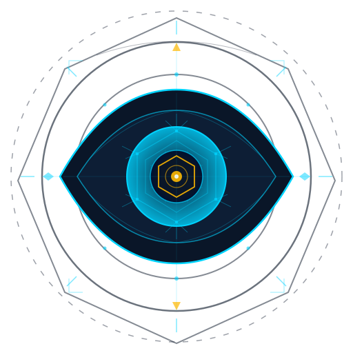
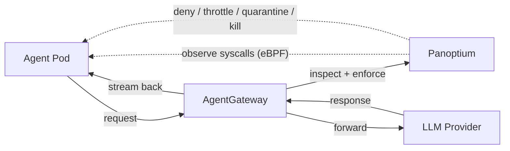

<p align="center">
  
</p>

<h1 align="center">Panoptium</h1>

<p align="center">
  Runtime security for Cloud Native AI agents.<br/>
  Observe, enforce, contain — before damage is done.
</p>

---

## The problem

AI agents are autonomous software that can execute tools, spawn processes, open network connections, and interact with external services — all without human approval at each step. When an agent gets compromised, jailbroken, or simply misbehaves, traditional container security tools have no idea what's happening. They see syscalls and network traffic, but they don't understand *intent*.

An agent that was told to "read a CSV file" but is now connecting to an external IP and exfiltrating data looks perfectly normal at the container level. It's just a process making a network call.

Panoptium is built to catch exactly this. It correlates what an agent *declares* it will do (through LLM tool calls) with what it *actually does* (at the kernel level), and enforces security policies in real time — blocking, throttling, quarantining, or killing agent pods when something doesn't add up.

## How it works



**Two observation layers, one decision point:**

1. **Network layer** — [AgentGateway](https://github.com/agentgateway/agentgateway) routes all agent-to-LLM traffic through an Envoy ExtProc filter. Panoptium inspects every request and response: tool names, arguments, model parameters, streaming tokens. It knows what the agent *asked* to do.

2. **Kernel layer** — [eBPF](https://github.com/cilium/ebpf) probes attached to agent pods observe syscalls in real time: file access, network connections, process spawning, namespace manipulation. It knows what the agent *actually did*. When an agent is quarantined, eBPF-LSM hooks can restrict its syscalls at the kernel level — no container restart needed.

3. **Policy engine** — evaluates both streams against rules you define as Kubernetes CRDs. Supports rate limiting, temporal sequences ("file write followed by outbound connection within 10s"), process ancestry matching, CIDR ranges, regex, glob patterns, and CEL expressions. Decisions in <5ms p99.

**When something goes wrong:**

- **Deny** — block the request with a 403 and a structured error explaining which rule fired.
- **Throttle** — rate-limit the agent with 429 responses.
- **Quarantine** — isolate the pod: deny-all NetworkPolicy, restrict syscalls via eBPF-LSM, snapshot filesystem state. The agent stays alive for forensic inspection but can't do further damage.
- **Kill** — evict the pod, taint the node, reclaim persistent volumes.

Escalation is automatic: three denied requests from the same agent within a time window triggers quarantine. You can also create `AgentQuarantine` resources manually.

## CRDs

Everything is configured through Kubernetes Custom Resources:

| CRD | Scope | Purpose |
|-----|-------|---------|
| `AgentPolicy` | Namespaced | Security rules: triggers, predicates, actions. Targets pods by label selector. |
| `AgentClusterPolicy` | Cluster | Same as above, but applies across all namespaces. |
| `AgentProfile` | Namespaced | Behavioral baselines for agent classes (what's "normal" for a coding assistant vs. a data analyst). |
| `ThreatSignature` | Cluster | Detection patterns for known attacks: prompt injection variants, tool poisoning, exfiltration techniques. Ships with defaults. |
| `AgentQuarantine` | Namespaced | Containment state for a pod: restricted, quarantined, or terminated. Created automatically or manually. |

## Quick start

```bash
# Helm
helm install panoptium chart/panoptium -n panoptium-system --create-namespace

# or kustomize
make deploy IMG=ghcr.io/panoptium/panoptium:latest
```

Apply a policy:

```yaml
apiVersion: panoptium.io/v1alpha1
kind: AgentPolicy
metadata:
  name: block-shell-exec
  namespace: default
spec:
  enforcementMode: enforcing
  rules:
    - name: deny-shell
      trigger:
        layer: protocol
        category: tool_call
      predicates:
        - field: toolName
          operator: "=="
          value: shell_exec
      action:
        type: deny
        parameters:
          message: "shell execution is not allowed"
```

Any pod with `app: my-agent` that tries to call `shell_exec` gets a 403.

More examples in [`examples/policies/`](examples/policies/) — from simple deny rules to rate limiting, escalation chains, threat signature enforcement, and cluster-wide baselines.

To tear down:

```bash
helm uninstall panoptium -n panoptium-system
```

## Roadmap

| Area | Status | What |
|------|--------|------|
| Policy engine | **Done** | Compiler, evaluator, composition resolver, rate limiting, temporal sequences, CEL predicates |
| Gateway enforcement | **Done** | ExtProc filter with deny/throttle/allow, decision caching, fail-open/fail-closed modes |
| CRD operator | **Done** | 5 CRDs, reconcilers, validating webhooks, Helm chart |
| eBPF observation | **Done** | Syscall monitoring via Tetragon, kernel event publishing to NATS |
| Threat signatures | **Done** | CRD-based detection patterns, regex + CEL hybrid, default signatures for prompt injection |
| Escalation & quarantine | **Done** | Automatic deny → quarantine escalation, NetworkPolicy isolation, pod eviction |
| Identity resolution | **Done** | Pod IP → metadata lookup, agent attribution for policy evaluation |
| Event bus | **Done** | Embedded NATS with JetStream for durable event streaming |
| Protocol parsers (MCP, A2A, Gemini) | **Code complete** | Parsers implemented and tested, not yet wired into the operator |
| Intent-action correlation | Planned | Match LLM-declared intents with observed kernel syscalls, detect divergence |
| Behavioral anomaly detection | Planned | Three-tier detection: in-kernel rules, statistical analysis, ML-based fleet-wide correlation |
| Cross-layer detection correlation | Planned | Combine signals from kernel, network, protocol, and LLM layers |
| Graduated containment | Planned | 5-level response: enhanced monitoring → capability restriction → quarantine → termination |
| Forensic audit trail | Planned | Hash-chained audit logs with compliance mapping (EU AI Act, NIST AI RMF) |
| Multi-cluster federation | Planned | Hub-spoke policy sync, cross-cluster threat intelligence sharing |

## Contributing

See [CONTRIBUTING.md](CONTRIBUTING.md).

## License

Apache License 2.0 — see [LICENSE](LICENSE) for details.
